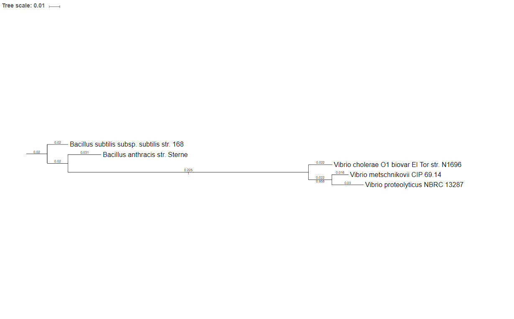

# Bacterial 16s Ribosomal RNA Alignment and Simple Tree Building

16s Ribosomal RNA is a highly conserved gene sequence with hypervariable regions. The highly conserved regions give insight into ancestral information and used to study phylogeny and taxonomy. It is mainly used for the following reasons:

* presence in almost all bacteria. 
* often exists as a multigene family, or operons.
* 16s rRNA gene has not changed overtime.
* Sequence is large enough for informatic purposes.

**Note:**
Although 16S rRNA gene sequencing is highly useful in regards to bacterial classification, it has low phylogenetic power at the species level and poor discriminatory power for some genera, and DNA relatedness studies are necessary to provide absolute resolution to these taxonomic problems. To resolve this issue a multilocus, or genome wide metric can be used such as average nucleotide identity, and average amino acid identity.

**Required Tools:**
* Extract_Sequence.py
* T Coffee
* Fastree
* Itol

**References:**

“16S RRNA Gene Sequencing for Bacterial Identification in the Diagnostic Laboratory: Pluses, Perils, and Pitfalls.” Accessed April 18, 2019. https://www.ncbi.nlm.nih.gov/pmc/articles/PMC2045242/.


#### Obtain 16s rRNA Sequences

For this example we will be using the following NCBI sequences:

GCF_000006745.1 &emsp; Vibrio cholerae O1 biovar El Tor str. N1696 <br>
GCF_000008165.1 &emsp; Bacillus anthracis str. Sterne <br>
GCF_000009045.1 &emsp; Bacillus subtilis subsp. subtilis str. 168 <br>
GCF_000176155.1 &emsp; Vibrio metschnikovii CIP 69.14 <br>
GCF_000467125.1 &emsp; Vibrio proteolyticus NBRC 13287 <br>

**Note:** NCBI provides 16s ribosomal RNA sequences for a variety of bacterial species. If the sequences are not available, 16s rRNA sequences can be extracted or pulled using a vast 16s rRNA database: green genes, NCBI, silva.

For this tutorial I used a Vibrio cholerae strain CECT 514's (NR_044853.1) 16s partial rRNA to pull the 16s Virbio sequences from the above fasta files. I also used Bacillus anthracis strain ATCC 14578 (NC_000964.3), and Bacillus subtilis subsp. subtilis str. 168 (NR_041248.1).

#### Command


```python
Extract_Sequence.py NR_044853.1.16s.fna GCF_000006745.1_ASM674v1_genomic.fna GCF_000006745.1.16s.fna
```

#### Concatenate 16s rRNA sequences

GCF_000006745.1.16s.fna <br>
GCF_000008165.1.16s.fna <br>
GCF_000009045.1.16s.fna <br>
GCF_000176155.1.16s.fna <br>
GCF_000467125.1.16s.fna <br>


```python
cat *5.1.16s.fna > all_16s.fna
```

#### Align Sequences

There are multiple softwares available for multiple genome alignments. Muscle is personally my favorite. progressiveMauve is also an alternative. I couldn't use either since my processor is not an i686. For this purpose I use T-Coffee Mutiple Sequence Alignment Tools. 

#### Command


```python
t_coffee all_16s.fna -in all_16s.fna -output fasta_aln > all_16s.txt
```

#### Create The Newick File and Visualize Tree

Here we use <a href="http://www.microbesonline.org/fasttree/">FastTree</a> and <a href="https://itol.embl.de/">iTol</a>. FastTree infers approximately-maximum-likelihood phylogenetic trees from alignments of nucleotide or protein sequences. Alternatively, we could use CLC Genomics Workbench, but that costs money.

#### Fast Tree Command


```python
FastTree -nt all_16s.fasta_aln > all_16s.nwck
```

#### iTol Dendogram
I added in the species name instead of NCBI's GCF ID. I used iTols advance menu to add in bootstrap values, and branch lengths. I finally rerooted the tree with *Bacillus subtillus*.



16s rRNA has low phylogenetic power at the species level and poor discriminatory power for some genera. DNA relatedness studies are necessary to provide absolute resolution to these taxonomic problems. See ANI_and_AAI.md file.
