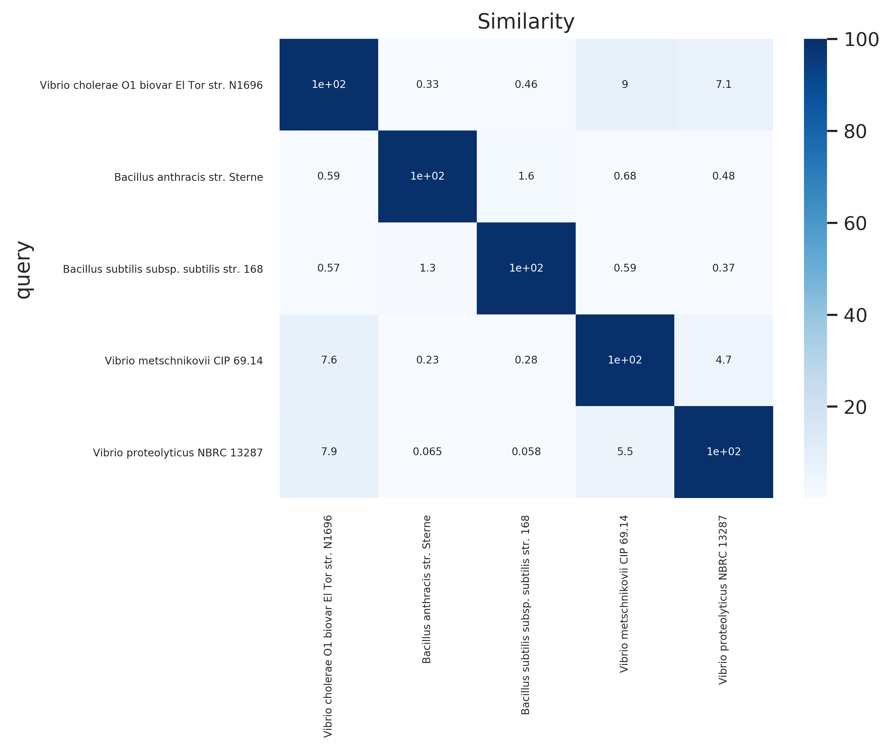
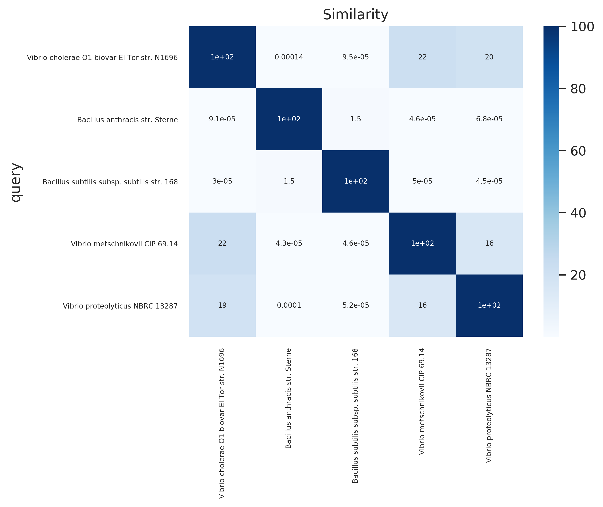
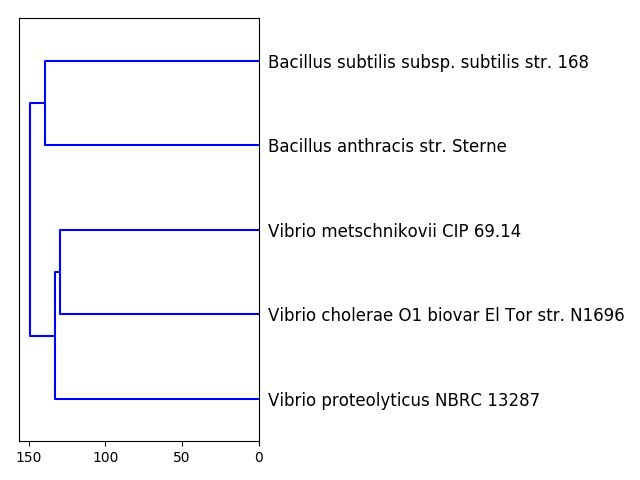
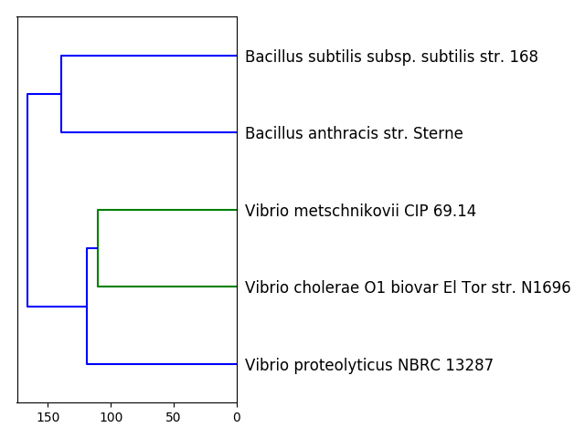

# Bacterial Genome Wide Nucleotide and Amino Acid Average Identity

Average nucleotide identity (ANI) and average amino acid identity (AAI) are robust measurements of bacterial strain relatedness. Both measurements contribute to a genome based taxonomy and alterantives for DNA-DNA hybridization (DHH) technique.

**References:**

“Microbiology Society Journals | Towards a Taxonomic Coherence between Average Nucleotide Identity and 16S RRNA Gene Sequence Similarity for Species Demarcation of Prokaryotes.” Accessed April 12, 2019.
https://ijs.microbiologyresearch.org/content/journal/ijsem/10.1099/ijs.0.059774-0.

“Towards a Genome-Based Taxonomy for Prokaryotes | Journal of Bacteriology.” Accessed April 12, 2019. https://jb.asm.org/content/187/18/6258.

**ANI and AAI Equations:**


$ \%\ Similarity\ =\ (Coverage\ *\ Score)\ /\ 100 $


#### Average Nucleotide Identity (ANI) Command:


```python
# Single query to a single reference:
Average_Nucleotide_Identity.py -q <query fna> -r <reference fna>
```

#### Average Nucleotide Identity w/ Mutiple References (ANIRs) Command:


```python
# Single query to multiple references:
ANIRs.py -q <query fna> -r <reference fna directory>
```

#### Average Amino Identity (AAI) Command:


```python
# Single query to a single reference:
Average_Amino_Identity.py -q <query faa file> -r <reference faa file>
```

#### Average Amino Identity w/ Multiple References (AAIRs) Command:


```python
ANIRs.py -q <query .faa> -r <reference .faa directory>
```

### Example of Batch Run (All versus All):

#### ANIRs:


```python
# ANI For loop to run all on files of interest.
for f in *.fna; do ./ANIRs.py -q $f -r references/; done
```

#### AAIRs:


```python
# ANI For loop to run all on files of interest.
for f in *.fna; do ./ANIRs.py -q $f -r references/; done
```

#### How to Combine ANI or AAI Output Files:


```python
head -n 1 GCF_000006745_coverage.tsv > All_Coverage.tsv; tail -q -n+2 *_coverage.tsv >> All_Coverage.tsv
```


```python
head -n 1 GCF_000006745_score.tsv > All_score.tsv; tail -q -n+2 *_score.tsv >> All_score.tsv
```


```python
head -n 1 GCF_000006745_similarity.tsv > All_similarity.tsv; tail -q -n+2 *_similarity.tsv >> All_similarity.tsv
```

#### Creating Heatmap for ANI or AAI
**Note:** Examples are of ANI/AAI similarity.


```python
Heatmap.py -in ani_similarity.tsv -title Similarity -out ani_similarity.png
```

</img>


```python
Heatmap.py -in aai_similarity.tsv -title Similarity -out aai_similarity.png
```

</img>

#### Creating Dendograms for ANI or AAI
**Note:** Examples are of ANI/AAI similarity.


```python
Dendogram.py -in ani_similarity.tsv -out ani_similarity.dm.png
```

</img>


```python
Dendogram.py -in aai_similarity.tsv -out aai_similarity.dm.png
```

</img>
