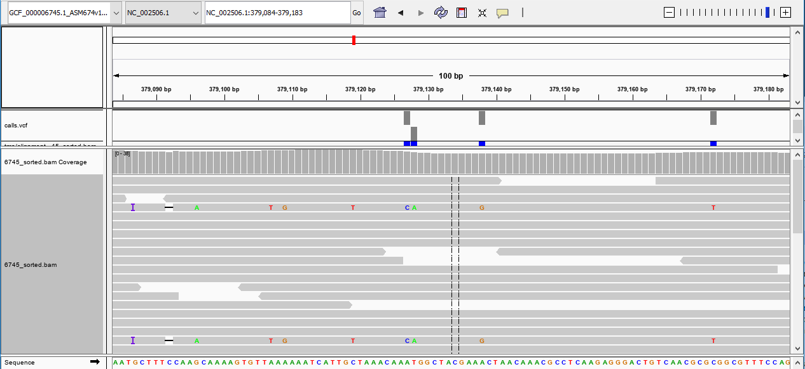

# Variant Calling Using Bowtie2, SAMtools, and BCFtools

This is just a brief notebook that goes into variant calling using bowtie2 and SAMtools.

[Bowtie2](http://bowtie-bio.sourceforge.net/bowtie2/index.shtml) is a fast and sensitive read aligner that performs end-to-end read alignment. It is excellent at aligning reads of about 50, 100, or 1000s of characters. It is especially good at aligning reads to relatively long genomes.

[SAM](http://samtools.sourceforge.net/) (Sequence Alignment/Map) format is a generic format for storing large nucleotide sequence alignments, which provide various utilities for manipulating alignments in the SAM format, including sorting, merging, indexing and generating alignments in a per-position format.

[BCFtools](https://samtools.github.io/bcftools/) is a set of utilities for variant calling and manipulating Variant Call Formats (VCFs) and Binary Call Formats (BCF)s.

**References**

Langmead B, Salzberg S. Fast gapped-read alignment with Bowtie 2. Nature Methods. 2012, 9:357-359.

Li H.*, Handsaker B.*, Wysoker A., Fennell T., Ruan J., Homer N., Marth G., Abecasis G., Durbin R. and 1000 Genome Project Data Processing Subgroup (2009) The Sequence alignment/map (SAM) format and SAMtools. Bioinformatics, 25, 2078-9. [PMID: 19505943]

Li H A statistical framework for SNP calling, mutation discovery, association mapping and population genetical parameter estimation from sequencing data. Bioinformatics. 2011 Nov 1;27(21):2987-93. Epub 2011 Sep 8. [PMID: 21903627]

**Authors of SAMtools and BCFtools:**

Heng Li from the Sanger Institute wrote the original C version of htslib, samtools and bcftools. Bob Handsaker from the Broad Institute implemented the BGZF library. Petr Danecek, Shane McCarthy and John Marshall are maintaining and further developing bcftools. Many other people contributed to the program and to the file format specifications, both directly and indirectly by providing patches, testing and reporting bugs. We thank them all.

#### Read Alignments To A Reference: 


```python
# Builds a bowtie index from a set of DNA sequences.
bowtie2-build <reference fasta file> reference
```


```python
# Aligns reads to reference genome using the index generated in the previous step.
bowtie2 -x reference -1 <fastq> -2 <fastq> > <output name w/ .sam>
```

#### Sorting and Indexing Aligned Read Bam File:


```python
# BAM-to-SAM conversion and subalignment retrieval piped into a sorting alignment.
samtools view -Sb <output sam> | samtools sort - > <sorted bam file>
```


```python
# Indexing the sorted alignment. 
samtools index <sorted bam>
```

#### Assessing Coverage Distribution:

This should be done prior to sorting the bam file.


```python
# Comprehensive statistics piped to get coverage distribution.
samtools stats < .bam file> | grep ^COV | cut -f 2- > <coverage distribution output>
```

#### Variant Calling: 


```python
# Fasta indexing and subsequence retrieval.
samtools-1.3.1/samtools faidx <references fasta>
```


```python
# Generating position-based output and consensus/indel calling
samtools mpileup -uf <fasta file> <sorted bam file> > <raw calls output .bcf>
```


```python
# SNP/indel calling
bcftools call -v -m <raw calls output .bcf> > <calls output .vcf>
```

#### Quality Filtering of Variant Calls:


```python
# Applying fixed-threshold filters then subsetting, filtering and convert VCF/BCF files
bcftools filter --exclude 'QUAL < 30' <calls .vcf> | bcftools view -g ^miss > <filtered calls output .vcf>
```


```python
# Subsetting, filtering and convert VCF/BCF files
bcftools view -v snps -m2 -M2 --min-ac 1:minor <filtered calls .vcf> > <snp output .vcf>
```

#### Genome Viewer: 

Here we use Integrative Genome Viewer to assess variant calls.



Alternatively, Genious Genome Broswer and CLC Genomics Workbench cane be used to map reads and view variant calls.
